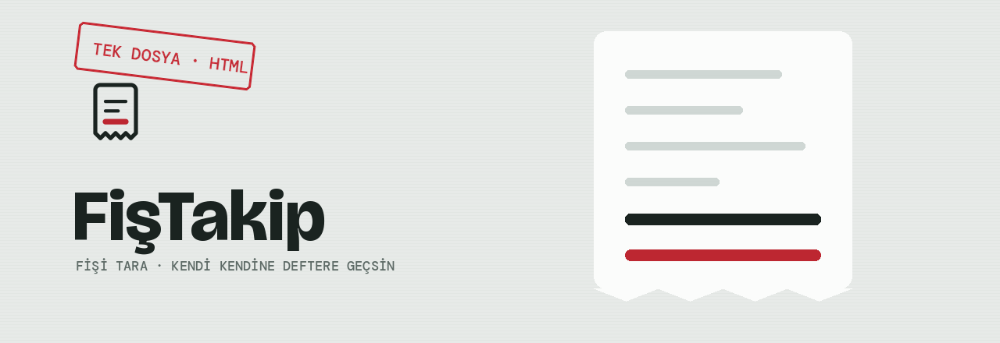

**Fişin fotoğrafını çek. Mağaza, tarih, ürünler ve tutar kendiliğinden yerine otursun.**

Tek bir HTML dosyası. Kurulum yok, sunucu yok, hesap yok.

[Canlı dene](https://kamilsaim.github.io/Fistakip/) · [Başla](#kullanmaya-başla) · [Okuma motorları](#okuma-motorları) · [Bütçe & fiyat](#bütçe-ve-fiyat-takibi) · [Gizlilik](#gizlilik)

---

## Ne yapar

Türk market ve mağaza fişlerini okuyup harcamanı defterler. Fişi tarar, içindekileri çıkarır, kategorisini bulur, aylık ve yıllık dökümünü tutar.

| | |
|---|---|
| 📷 **Fiş okuma** | Dört ayrı motor. Biri tamamen çevrimdışı çalışır. |
| 🏬 **Mağaza birleştirme** | "LC WAIKIKI" ile "LC Waikiki" tek mağaza sayılır. 40+ Türk markası tanınır. |
| 🗂 **Otomatik kategori** | Gıda, Ev & Yaşam, Kıyafet, Yakıt, Eczane ve 4 kategori daha. |
| 💳 **Ödeme takibi** | Kredi kartı / nakit ayrımı, dağılımıyla birlikte. |
| 📊 **Aylık seyir** | 6 aylık grafik, geçen aya kıyas, mağaza ve kategori dökümü. |
| 🎯 **Kategori bütçesi** | Aylık üst sınır koy; %80'de uyarır, aşınca fiş kaydederken haber verir. |
| 📈 **Ürün fiyat takibi** | Aynı ürünün birim fiyatı zaman içinde nasıl değişti — geçmişi ve eğrisiyle. |
| 🔍 **Arama** | Mağaza, ürün adı, kategori ve ödeme şeklinde filtreleme. |
| 📗 **Excel çıktısı** | 6 sayfalı `.xlsx` — fişler, kategori, mağaza, ödeme, aylık özet, ürün fiyatları. |
| 💾 **Yedekleme** | JSON al-ver. Cihaz değiştirince veri taşınır. |
| 🌙 **Karanlık mod** | Telefonun ayarına göre kendiliğinden. |

Fiş okunamazsa elle de girebilirsin; yanlış okunan alanı kaydetmeden düzeltirsin.

---

## Kullanmaya başla

[kamilsaim.github.io/Fistakip](https://kamilsaim.github.io/Fistakip/) adresini aç. Kurulum, hesap, izin yok.

iPhone'da Paylaş → *Ana Ekrana Ekle*, Android'de menü → *Uygulamayı yükle* dersen ana ekrana **fiş logosuyla** iner ve adres çubuğu olmadan açılır.

---

## Okuma motorları

Ayarlar ⚙️ menüsünden seçilir. Anahtarlar **kodun içine değil, cihazın yerel hafızasına** yazılır — depo herkese açık kalabilir.

| Motor | Doğruluk | Ücret | Kota | Anahtar |
|---|---|---|---|---|
| **Yerel OCR** | Orta | Ücretsiz | Sınırsız | Gerekmez |
| **Gemini** ⭐ | Yüksek | Ücretsiz | ~1.500/gün | [AI Studio](https://aistudio.google.com/apikey) |
| **Claude** | Yüksek | ~$0,003/fiş | — | [Console](https://console.anthropic.com/settings/keys) |
| **OCR.space** | Orta-yüksek | Ücretsiz | 25.000/ay | [ocr.space](https://ocr.space/ocrapi/freekey) |

**Gemini önerilir** — ücretsiz katmanı var, kredi kartı istemez, fişi yalnız okumakla kalmaz anlar da.

Gemini'de model erişimi hesaba göre değişir. Uygulama `404` alırsa anahtarının erişebildiği modelleri kendisi listeler, uygun olanı seçer ve kaydeder. Ayarlardan elle de seçebilirsin.

<b>Yerel OCR nasıl çalışıyor?</b>

Tesseract.js tarayıcıda çalışır — fotoğraf hiçbir sunucuya gitmez. Öncesinde görüntü işlenir: gri tonlama, histogram gerdirme, yumuşak eşikleme ve 2,5× büyütme. Ardından çıkan metin Türk fişlerine göre yazılmış bir ayrıştırıcıdan geçer:

- `1.250,00` → `1250.00` (Türk sayı biçimi)
- `TOPKDV` ile `TOPLAM` ayrımı
- Ticari unvan temizliği (`LTD`, `ŞTİ`, `SAN.`, `TİC.`)
- Adres, VD/VN, POS no, onay kodu, EKÜ satırlarının elenmesi
- Ürün satırlarının tutar sütununa göre çıkarılması

İlk taramada Türkçe dil paketi (~2 MB) iner, sonra önbellekte kalır.

---

## Bütçe ve fiyat takibi

İkisi de Özet sekmesinde, ayrıca bir şey açmadan.

**Aylık bütçe.** *Düzenle*'ye dokun, takip etmek istediğin kategoriye üst sınır gir — boş bıraktığın kategori izlenmez. Kategorilerin üstünde ayrıca tüm harcama için ortak bir sınır konabilir. Satır limitin %80'ine gelince turuncuya, aşılınca mali kırmızıya döner ve **AŞILDI** damgası alır. Fişi kaydettiğin an ilgili limit aşıldıysa uygulama haber verir. Limitler yedeğe dahildir.

**Fiyat seyri.** Aynı ürünü ikinci kez alınca listede çıkar. Karşılaştırma **birim fiyat** üzerinden yapılır (satır tutarı ÷ adet), yani 4'lü aldığın sütle tek aldığın süt aynı ölçekte. Satırda kaç kez alındığı, en düşük–en yüksek aralık, ilk alıştan bugüne değişim ve minik fiyat eğrisi durur; dokununca hangi tarihte hangi mağazada kaça aldığın ve önceki alışa göre kaç lira fark ettiği açılır.

Ürün adları eşleştirilirken gramaj ve adet ekleri temizlenir — `SÜT 1 LT`, `Süt 1lt` ve `süt  1 LT` tek üründür. Bu yüzden farklı gramajlar da aynı sayılabilir; ayrıştırıcı ürün satırı çıkarmayan bir fişte (ör. akaryakıt) fiyat takibi olmaz.

---

## Gizlilik

- **Fişler cihazdan çıkmaz.** Hepsi tarayıcının `localStorage`'ında durur. Sunucu yok, hesap yok, analitik yok.
- **Yerel OCR'da** hiçbir veri ağa çıkmaz.
- **Yapay zeka motorlarında** fotoğraf yalnız senin seçtiğin sağlayıcıya gider. Gemini'nin ücretsiz katmanında Google, gönderilen veriyi model eğitiminde kullanabilir — hassas fişler için ücretli katmana geç ya da yerel OCR kullan.
- **API anahtarları** cihazda kalır, depoya asla yazılmaz.

> [!WARNING]
> Veriler tarayıcı hafızasında olduğu için iOS Safari, uzun süre açılmayan sitelerin verisini silebilir. Ayarlar → **Yedek al** ile ara sıra JSON yedeği çıkar.

---

## Nasıl çalışır

Tek bir `index.html`. Derleme aracı, paket yöneticisi, `node_modules` yok. Kütüphaneler yalnız gerektiğinde CDN'den çekilir:

| Kütüphane | Ne zaman iner | Ne için |
|---|---|---|
| Tesseract.js | Yerel OCR ilk kullanımda | Çevrimdışı metin okuma |
| SheetJS | Excel çıktısı alınırken | `.xlsx` üretimi |

Uygulama açılırken hiçbiri inmez.

Yanında duran diğer dosyalar yalnızca kimlik içindir: ana ekran ikonu (`icon-512.png`), `manifest.webmanifest` ve logo varyantları. Uygulama mantığının tamamı `index.html` içinde.

---

## Tasarım

Tasarım dili konunun kendisinden alındı: **termal fiş kağıdı.**

<table>
<tr>
<td width="90" align="center"></td>
<td>

Zemin krem değil, fiş kağıdının soğuk gri-yeşili. Mürekkep saf siyah değil, termal yazıcının isli karası. Kartların altı yırtık, tutarlar monospace sütunda hizalı.

Tek vurgu rengi **mali damga kırmızısı** ve anlam taşıyor: logodaki kırmızı satır fişin **toplamı**.

</td>
</tr>
</table>

| Rol | Hex |
|---|---|
| Termal is | `#1A2320` |
| Mali kırmızı | `#BD2731` |
| Termal kağıt | `#E7EAE8` |
| Fiş beyazı | `#FBFCFB` |
| Çizgi grisi | `#C9D2CE` |
| Karbon (koyu tema) | `#0F1211` |

**Yazı tipleri** — Bricolage Grotesque (başlık), Archivo (metin), DM Mono (rakam ve etiket).

Logo ailesi ve kullanım kuralları: [`logo-kilavuz.html`](logo-kilavuz.html)

---

## Yol haritası

- [x] Ürün fiyat takibi — aynı ürünün zaman içindeki fiyat değişimi *(v1.2.0)*
- [x] Kategori bazlı aylık bütçe ve limit uyarısı *(v1.2.0)*
- [ ] Taksitli alışveriş takibi
- [ ] Fiş fotoğrafının kayda iliştirilmesi
- [ ] Çoklu cihaz eşitleme (isteğe bağlı, kendi sunucunla)

---

## Katkı

Sorun bildirimi ve öneri için [issue aç](https://github.com/kamilsaim/Fistakip/issues).

Tanınmayan bir mağaza varsa `STORE_ALIASES` dizisine, kaçırılan bir kategori varsa `CATS` dizisine eklemek yeterli — ikisi de `index.html` içinde.

---

## Lisans

MIT — [LICENSE](LICENSE)
